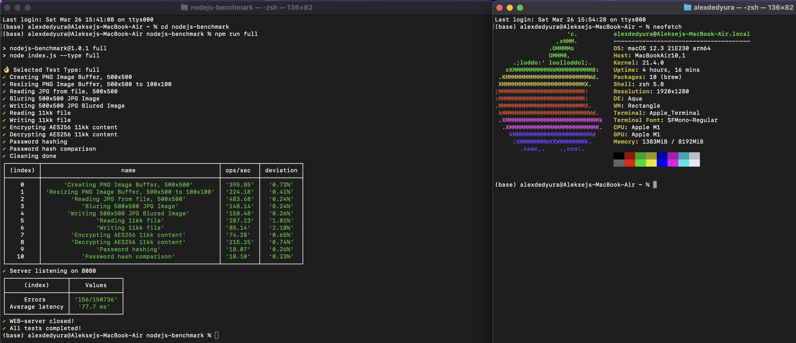

<h1 align="center">NodeJS Benchmark</h1>

<p align="center">
  
  <br>
  <i>My test allows you to find out the performance of your processor when using JavaScript. The program has many tests, described below. The time spent on the calculation is counted as the result of the test. The result is determined by the average of 10 attempts. Powered by NodeJS. Lower is better.</i>
  <br>
</p>

Tests:
- Reading huge text files
- Writing huge text files
- Text encoding
- Text decoding
- Password hashing
- Password hash comprasion
- Image resize/blur
- Image generation
- Reading images
- Writing images

Supported architectures:
- x86 (AMD, Intel)
- ARM (Apple Silicon, Raspberry Pi, Qualcomm and etc)

Thanks a lot [powerdot](https://github.com/powerdot) for JS code base!

## How to install
### Install NodeJS from official website (Current or LTS)

https://nodejs.org/

### Clone repository and entering directory
```bash
git clone https://github.com/alexdedyura/nodejs-benchmark
cd nodejs-benchmark
```
### Install dependencies with npm
```bash
npm install
```

## Benchmark

### Full
Full test.
```bash
npm run full
```

### Only specific load 
How fast is your server with big text files, images and encryption?
```bash
npm run loadtest
```

### Only load with requests Web-server
How fast is your server can response to queries?
```bash
npm run queries
```

### Re-Install dependencies
If you have problems installing nodejs dependencies or you have updated any of the packages, this command will help you
```bash
npm run rebuild
```
## Benchmark Results

### Apple M1

